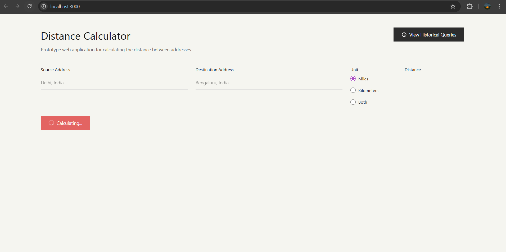
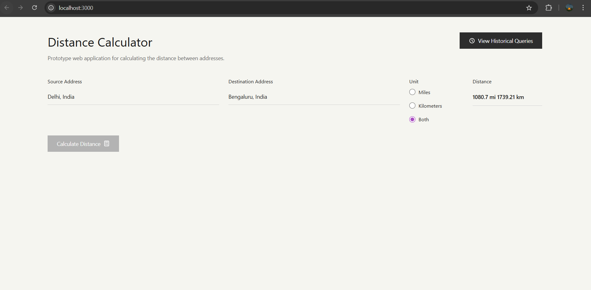
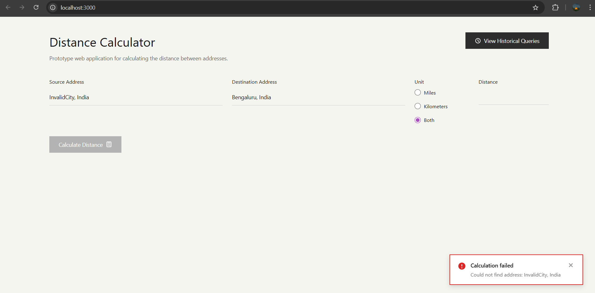
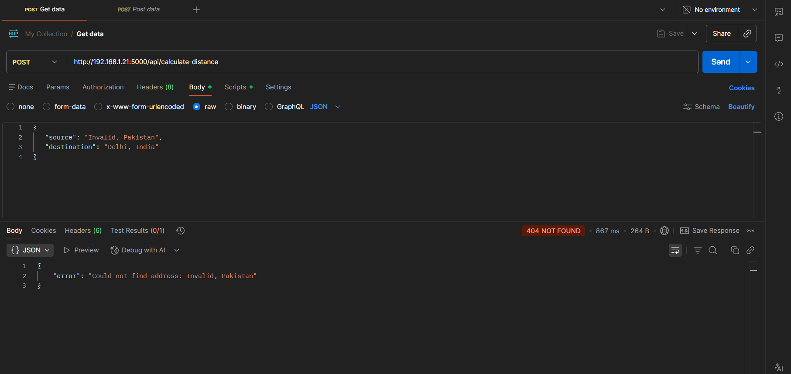

## Screenshots of the app:








## Mannual and unit testing:




## Docker

Images published in dockerhub:
Backend- https://hub.docker.com/r/shivam18213/distance-calculator
Frontend- https://hub.docker.com/r/shivam18213/distance-calculator-frontend


## Setup Instructions

### Backend Setup

1. **Navigate to the backend directory:**
   ```bash
   cd backend
   ```

2. **Create a virtual environment (recommended):**
   ```bash
   python -m venv venv
   source venv/bin/activate  # On Windows: venv\Scripts\activate
   ```

3. **Install dependencies:**
   ```bash
   pip install -r requirements.txt
   ```

4. **Run the Flask server:**
   ```bash
   python app.py
   ```

   The backend will start on `http://localhost:5000`

### Frontend Setup

1. **Navigate to the frontend directory:**
   ```bash
   cd frontend
   ```

2. **Install dependencies:**
   ```bash
   npm install
   ```

3. **Start the development server:**
   ```bash
   npm start
   ```

   The frontend will start on `http://localhost:3000` and automatically open in your browser.

## API Endpoints

### POST `/api/calculate-distance`
Calculate distance between two addresses.

**Request Body:**
```json
{
  "source": "New York, NY",
  "destination": "Los Angeles, CA"
}
```

**Response:**
```json
{
  "source": "New York, NY",
  "destination": "Los Angeles, CA",
  "distance_km": 3944.42,
  "distance_miles": 2451.03,
  "source_coords": {
    "lat": 40.7128,
    "lon": -74.0060
  },
  "destination_coords": {
    "lat": 34.0522,
    "lon": -118.2437
  }
}
```

### GET `/api/history`
Retrieve past distance queries.

**Query Parameters:**
- `limit` (optional): Maximum number of records to return (default: 50, max: 100)

**Response:**
```json
{
  "queries": [
    {
      "id": 1,
      "source": "New York, NY",
      "destination": "Los Angeles, CA",
      "source_coords": {
        "lat": 40.7128,
        "lon": -74.0060
      },
      "destination_coords": {
        "lat": 34.0522,
        "lon": -118.2437
      },
      "distance_km": 3944.42,
      "distance_miles": 2451.03,
      "timestamp": "2024-02-10 14:30:00"
    }
  ],
  "count": 1
}
```

### GET `/api/health`
Health check endpoint.

**Response:**
```json
{
  "status": "healthy"
}
```

## Security Features

1. **Input Validation:**
   - Address length constraints (3-200 characters)
   - SQL injection pattern detection
   - Type checking and sanitization

2. **Error Handling:**
   - Graceful handling of geocoding failures
   - API timeout protection (10 seconds)
   - Database error handling

3. **CORS Configuration:**
   - Configured for local development
   - Should be restricted in production

4. **Logging:**
   - Comprehensive logging for debugging
   - Security event logging (injection attempts)
   - API request/response logging

## Database Schema

```sql
CREATE TABLE queries (
    id INTEGER PRIMARY KEY AUTOINCREMENT,
    source_address TEXT NOT NULL,
    destination_address TEXT NOT NULL,
    source_lat REAL NOT NULL,
    source_lon REAL NOT NULL,
    dest_lat REAL NOT NULL,
    dest_lon REAL NOT NULL,
    distance_km REAL NOT NULL,
    distance_miles REAL NOT NULL,
    timestamp DATETIME DEFAULT CURRENT_TIMESTAMP
);
```

## Distance Calculation

The application uses the **Haversine formula** to calculate the great-circle distance between two points on Earth:

```
a = sin²(Δlat/2) + cos(lat1) × cos(lat2) × sin²(Δlon/2)
c = 2 × atan2(√a, √(1−a))
d = R × c
```

Where:
- R is Earth's radius (6,371 km)
- Δlat is the difference in latitude
- Δlon is the difference in longitude

## Usage Examples

1. **Simple Distance Calculation:**
   - Enter "Paris, France" as source
   - Enter "London, UK" as destination
   - Click "Calculate Distance"
   - View result in km or miles

2. **View History:**
   - Click "Show Query History" button
   - See all past calculations
   - Toggle between km/miles units

3. **Error Handling:**
   - Try entering an invalid address
   - See user-friendly error message
   - Check logs for detailed error information


## Troubleshooting

**Backend won't start:**
- Check if port 5000 is available
- Verify Python version (3.8+)
- Check all dependencies are installed

**Frontend won't connect to backend:**
- Verify backend is running on port 5000
- Check CORS configuration
- Inspect browser console for errors

**Geocoding failures:**
- Check internet connection
- Verify Nominatim API is accessible
- Check address format
- Review rate limiting policies

**Database errors:**
- Check write permissions in backend directory
- Verify SQLite is installed
- Check database file isn't corrupted
